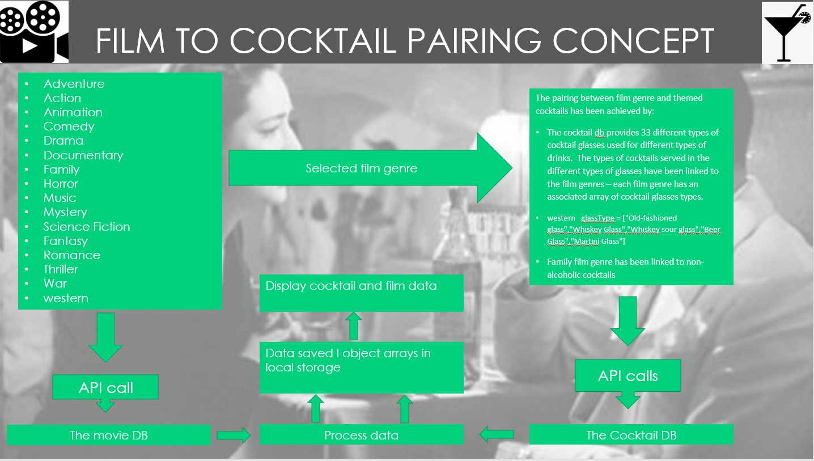

# 07 Project 1: Interactive Front-End Application

FilmTails App was developed for the first group project set by the University of Birmingham and Trilogy Ltd's Coding Bootcamp. The aim of this project was to work together, collaboratively, in a group  with fellow students to create an application which resolves a real-world 
problem.

## Set Project Requirements
Use a CSS framework other than Bootstrap.

- Be deployed to GitHub Pages.
- Be interactive (i.e., accept and respond to user input).
- Use at least two [server-side APIs](https://coding-boot-camp.github.io/full-stack/apis/api-resources).
- Does not use alerts, confirms, or prompts (use modals).
- Use client-side storage to store persistent data.
- Be responsive.
- Have a polished UI.
- Have a clean repository that meets quality coding standards (file structure, naming conventions, follows best practices for class/id naming conventions, indentation, quality comments, etc.).
- Have a quality README (with unique name, description, technologies used, screenshot, and link to deployed application).

## Contributors

- Amaal: https://github.com/amaalSaid
- Debra: https://github.com/Beanalini
- Joseph: https://github.com/JospehBalshaw
- Michael: https://github.com/munnos


# FilmTails 🎥🍸

## Motivation

I'm sure like us, you've decided to watch a film with friends or family and spent time leafing through Netflix, Amazon Prime and similar sites trying to find a film you all agree upon. 

Well...we can  bypass that wasted time and potential contention with our App, FilmTails! Not only will we make film suggestions based on your selected film genre, we  also pair your selected film genre with defined classes of cocktails  including instructions on how to make them. If that choice is still too much - there's an option to select a random film matched to a cocktail. After all, who doesn't want to watch a film and enjoy a cocktail at the same time!?

## Project Description

### MVP

- Provide the user with a stress free route to choosing a film and suggesting a cocktail pairing linked to the genre of film selected.
- The user will have the option to select a film genre from a drop down list.
- Suggestions of four films for the selected film genre will be displayed along with 4 themed cocktails.
- Give the user the option to select a film randomly from all genres – one film suggestion and a themed cocktail will be displayed to the user


### User story 

As a group we formulated the  following user story and criteria based on  our MVP:

```md

AS A film and cocktails fan
I WANT to be presented with a selection of films linked to cocktail suggestions themed to the genre of film chosen, along with instructions on how to make the cocktail
SO THAT I don’t waste time searching for a film and can enjoy a cocktail in comfort
```


### Acceptance Criteria

As a group we set ourselves the following criteria for our application:

```md
GIVEN I  want to use a  film and cocktail generator App to provide film and cocktail recommendations
When I open the App
THEN I am presented with  a  selection films genres to choose from and a random selection option
WHEN  I select one film genre
Then I am presented with a selection of film recommendations and paired cocktails.
When I click on the film overview button
Then I am presented with a synopsis of the film.
When I click on the cocktail instructions button I want to see the recipe and ingredients
When I select family film genre 
Then I want to be presented non-alcoholic cocktail recommendations.
When I select random film and cocktail pairing
I want to see one film and cocktail recommendation only

```


### APIs used

- The Movie Database API  - An API that provides movie information
- The Cocktail db an API that provides cocktail recipes

### How we linked Film Genre to cocktail classes




## Challenges

- Agreeing on the initial  concept
- API interrogation 
- Cocktail db needed successive interrogations – sync await functions used to avoid undefined arrays whilst waiting for fetch promise
- Working around commitments
- Using new UI framework, linking  header/footer
- Integrating contributions


## Successes

- Getting the APIs to work
- Integrating contributions
- Using Git branches and resolving GitHub issues
- Supporting each other with problem solving on code
- Using Semantic UI to display film and cocktail data
- Implementing our MVP


## Future Development

- Give the user the option to save and retrieve film and cocktail suggestions
 - Give the user the option to filter films by actor, rating, etc
- Give the user the option to select alcoholic/non-alcoholic cocktails for all film genres
- Give the user the option to filter cocktails by ingredients readily available
- Implement variable mapping for API links for cocktail and film classes selection
- Polish the UI
- Make the UI fully responsive
- Carefully vet the film API categories – occasionally returns a spurious category


## Technologies Used

- Semantic UI
- HTML
- CSS
- JS
- JQuery
- Cocktail dB API
- Movie dB API


## Screenshots


<br/>

<br/>

<br/>

<br/>


## Deployment 

https://munnos.github.io/Movietails/

## Link to presentation

https://docs.google.com/presentation/d/1VkNgCqsFCysZCP0z3ZsQRsZYDKHZ42O_/edit?usp=sharing&ouid=111965145354671376542&rtpof=true&sd=true

